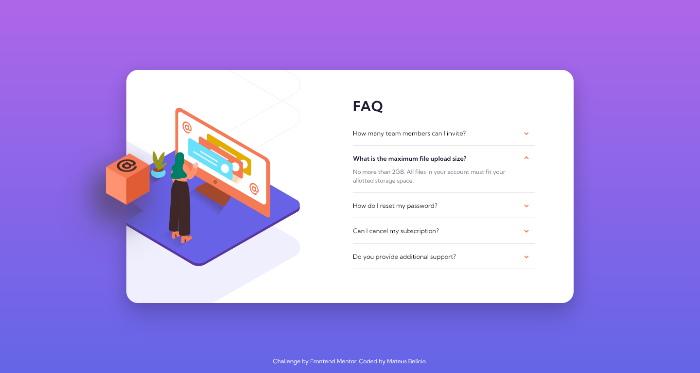

  
  <h2 align="left">Frontend Mentor - FAQ accordion card solution</h2>

This is a solution to the [FAQ accordion card challenge on Frontend Mentor](https://www.frontendmentor.io/challenges/faq-accordion-card-XlyjD0Oam). Frontend Mentor challenges help you improve your coding skills by building realistic projects.

<!--  -->

&dot;
 
&dot;

---

### The challenge

Users should be able to:

- View the optimal layout for the component depending on their device's screen size
- See hover states for all interactive elements on the page
- Hide/Show the answer to a question when the question is clicked

### Screenshot

### Built with

- Semantic HTML5 markup
- CSS custom properties
- Flexbox
- Mobile-first workflow
- SASS

---

### Author

- Frontend Mentor - [@mateusbelicio](https://www.frontendmentor.io/profile/mateusbelicio)
- Linkedin - [@mateusbelicio](https://www.linkedin.com/in/mateusbelicio)
